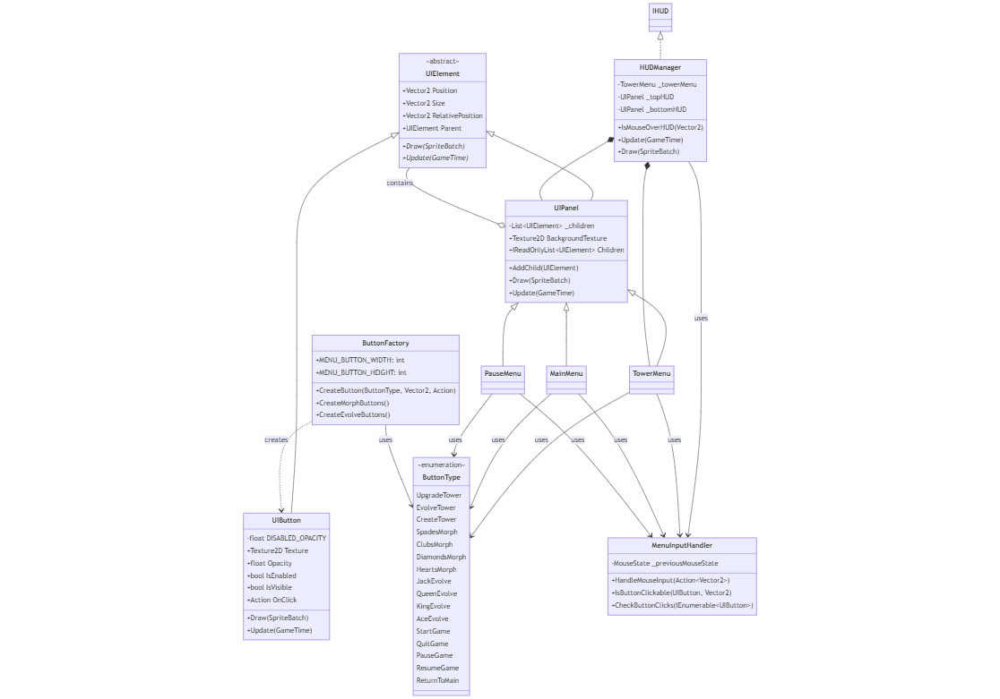
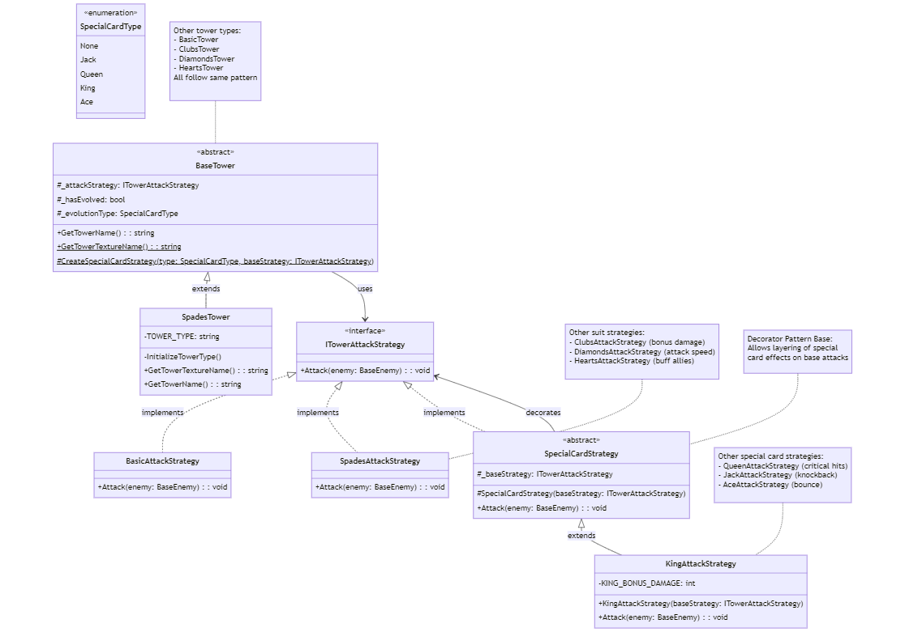

# Suits of Siege
### A C# Tower Defence Game with a Strategic Twist


## Game Overview
Suits of Siege is a tower defence game that combines strategic defence mechanics with a unique playing card theme. Built using the MonoGame Framework for foundational operations, the project features custom-built systems for gameplay mechanics, state management, and rendering. Players defend their base against waves of increasingly challenging enemies through strategic tower placement and powerful upgrades.

## Key Features
* 🃏 **Unique Card Theme:** In this world, playing cards exist as living entities where lower-ranked cards have revolted against their superiors. This conflict directly influences the core game mechanics, with Joker bosses appearing as leaders of the rebellion.
* 🔧 **Dynamic Tower Progression:** Towers begin at level 6 and can be upgraded to level 10. They can "Morph" into one of four suits (Spades, Clubs, Hearts, Diamonds) for unique abilities and, at max level, "Evolve" into special cards like the Jack, Queen, or King.
* ⚔️ **Strategic Combat System:** Each suit provides towers with unique abilities, such as Spades applying a slow effect or Clubs dealing bonus damage. This system uses the Strategy and Decorator design patterns to allow special evolved cards to layer their effects, like a "Queen" adding a critical hit chance on top of any suit's base ability.
* 👾 **Progressive Enemy Waves:** The game challenges the player with five distinct tiers of enemies with escalating health. Powerful Joker bosses with high health appear every five waves to test the player's defensive strategy.

## Architectural Deep-Dive
This project was an opportunity to perform a deep-dive into software architecture and object-oriented design principles.

The game is built on an **event-driven architecture** coordinated by a central `GameManager`. This design ensures a clean separation of concerns and allows for efficient, decoupled communication between major components like the `TowerManager`, `WaveManager`, and `RenderingManager`.

### Software Design Patterns
To ensure the code is clean, maintainable, and scalable, several key software design patterns were deliberately implemented:
* **Singleton:** Used for global access to critical systems like the `GameManager` and `EventSystem`.
* **Factory:** Manages the creation of complex objects like towers, enemies, and UI buttons through specialised factories.
* **Strategy:** Defines interchangeable tower attack behaviours, allowing each suit to have a unique effect.
* **Decorator:** Implements special card effects (Queen, King, etc.) by wrapping and extending the base suit strategies without modifying their code.
* **Observer (Pub/Sub):** The `EventSystem` allows game components to subscribe and react to events (e.g., `TowerSelected`, `BaseDamaged`) without being tightly coupled.
* **Command:** Encapsulates all tower operations (Place, Morph, Upgrade) into command objects, which are then executed by the `TowerManager`.

### Code Snippets
**Decorator Pattern: KingAttackStrategy.cs**:
This pattern allows for adding new behaviours to objects dynamically. Here, `KingAttackStrategy` "decorates" a base attack by adding bonus damage without altering the base attack's code.

```csharp
// King Attack Strategy, Implementing the Decorator Pattern to Add Bonus Damage
public class KingAttackStrategy : SpecialCardStrategy
{
    // Constant Defining the Bonus Damage for the King Strategy
    private const int KING_BONUS_DAMAGE = 100; 

    // Initializes the King Strategy with the Given Base Attack Strategy
    public KingAttackStrategy(ITowerAttackStrategy baseStrategy)
        : base(baseStrategy) 
    {
    }

    // Overrides the Attack Method, Adding Bonus Damage to Each Attack
    public override void Attack(BaseEnemy enemy)
    {
        base.Attack(enemy); 
        enemy.ReceiveDamage(KING_BONUS_DAMAGE); 
    }
}
```
**Factory Pattern: TowerFactory.cs**:
The Factory pattern is used to abstract the complex process of object creation. This method creates different tower types based on the `suitType` provided, decoupling the client code from the specific tower creation logic.
```csharp
// Creates a Tower Instance Based on the Specified Suit Type
private BaseTower CreateTowerBySuitType(TowerSuitType suitType, Texture2D towerTexture, Texture2D projectileTexture, Vector2 position, int level)
{
    return suitType switch
    {
        TowerSuitType.Spades => new SpadesTower(towerTexture, projectileTexture, position, _behaviourManager, _towerManager, level),
        TowerSuitType.Clubs => new ClubsTower(towerTexture, projectileTexture, position, _behaviourManager, _towerManager, level),
        TowerSuitType.Diamonds => new DiamondsTower(towerTexture, projectileTexture, position, _behaviourManager, _towerManager, level),
        TowerSuitType.Hearts => new HeartsTower(towerTexture, projectileTexture, position, _behaviourManager, _towerManager, level),
        _ => new BasicTower(towerTexture, projectileTexture, position, _behaviourManager, _towerManager, level)
    };
}
```

## UML Diagrams
The following diagrams illustrate some of the key architectural systems built for the project to ensure a clean, maintainable, and scalable codebase.

<p align="center">
  <i>This first diagram details the UI System, showing the relationships between managers, factories, and the core UI elements.</i>
  <br>
  
</p>
<br>
<p align="center">
  <i>This second diagram showcases the Strategy and Decorator patterns used to create a flexible and extensible tower attack system.</i>
  <br>
  
</p>

### Project Documentation
For a deeper dive into the project's design, architecture, and codebase structure, please see the detailed technical documents below:

* **[Game Design Document](./docs/DESIGN_DOCUMENT.md):** The original design document covering the game's overview, theme, mechanics, and systems.
* **[Codebase Overview](./docs/CODEBASE_OVERVIEW.md):** A guided tour of the project's source code structure and organisation.
* **[Architectural Decisions](./docs/ARCHITECTURAL_DECISIONS.md):** An explanation of the key software design patterns used and the reasoning behind them.

## How to Run
This project is a portfolio showcase and is not available for public distribution. Please see the video and code snippets above for a demonstration of its functionality and architecture.
