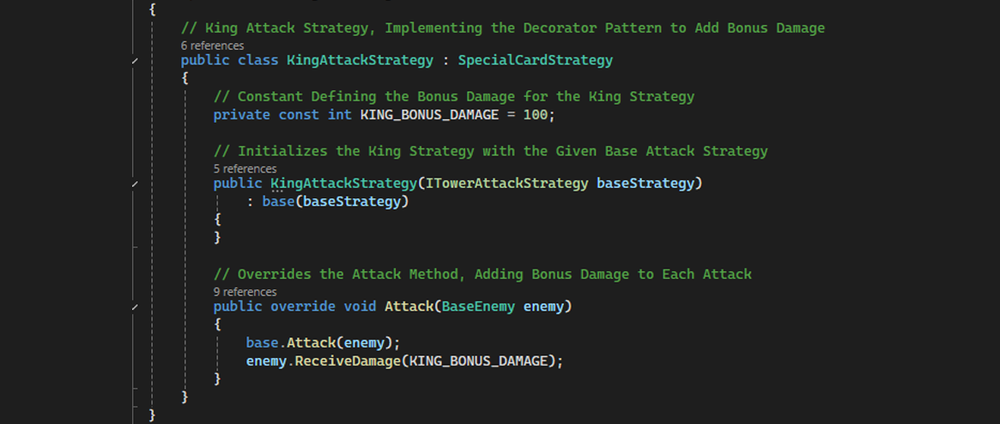
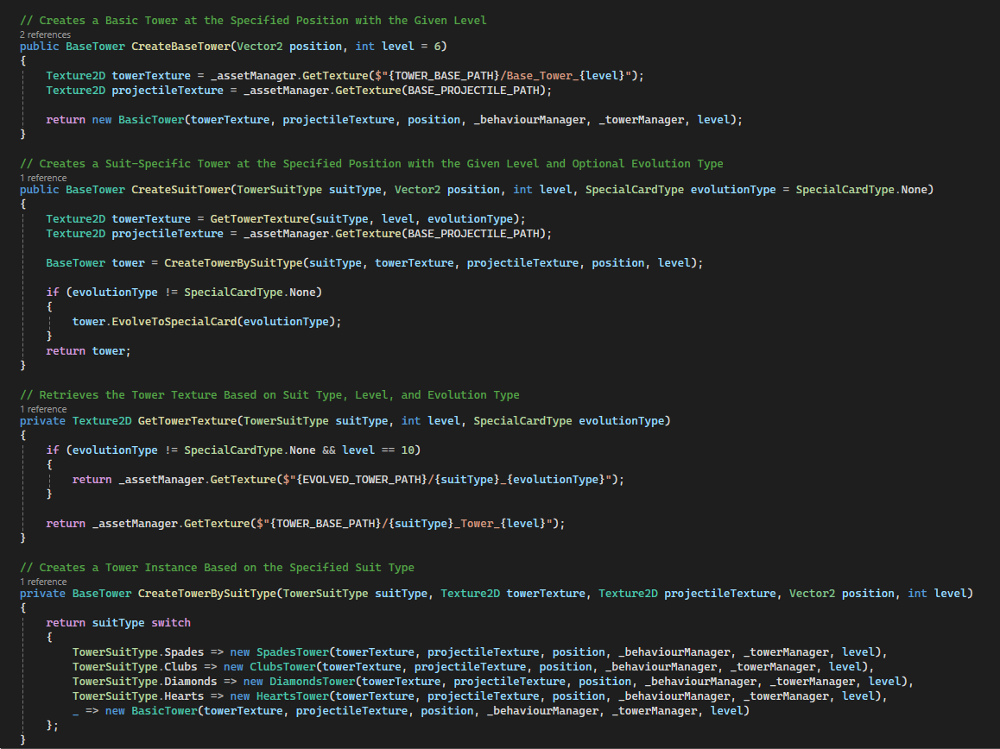

# Suits of Siege
### A C# Tower Defence Game with a Strategic Twist

## Game Overview
Suits of Siege is a tower defence game that combines strategic defence mechanics with a unique playing card theme. Built using the MonoGame Framework for foundational operations, the project features custom-built systems for gameplay mechanics, state management, and rendering. Players defend their base against waves of increasingly challenging enemies through strategic tower placement and powerful upgrades.

## Key Features
* 🃏 **Unique Card Theme:** In this world, playing cards exist as living entities where lower-ranked cards have revolted against their superiors. This conflict directly influences the core game mechanics, with Joker bosses appearing as leaders of the rebellion.
* 🔧 **Dynamic Tower Progression:** Towers begin at level 6 and can be upgraded to level 10. They can "Morph" into one of four suits (Spades, Clubs, Hearts, Diamonds) for unique abilities and, at max level, "Evolve" into special cards like the Jack, Queen, or King.
* ⚔️ **Strategic Combat System:** Each suit provides towers with unique abilities, such as Spades applying a slow effect or Clubs dealing bonus damage. This system uses the Strategy and Decorator design patterns to allow special evolved cards to layer their effects, like a "Queen" adding a critical hit chance on top of any suit's base ability.
* 👾 **Progressive Enemy Waves:** The game challenges the player with five distinct tiers of enemies with escalating health. Powerful Joker bosses with high health appear every five waves to test the player's defensive strategy.

## Architectural Deep-Dive
This project was an opportunity to perform a deep-dive into software architecture and object-oriented design principles.

The game is built on an **event-driven architecture** coordinated by a central `GameManager`. This design ensures a clean separation of concerns and allows for efficient, decoupled communication between major components like the `TowerManager`, `WaveManager`, and `RenderingManager`.

### Software Design Patterns
To ensure the code is clean, maintainable, and scalable, several key software design patterns were deliberately implemented:
* **Singleton:** Used for global access to critical systems like the `GameManager` and `EventSystem`.
* **Factory:** Manages the creation of complex objects like towers, enemies, and UI buttons through specialised factories.
* **Strategy:** Defines interchangeable tower attack behaviours, allowing each suit to have a unique effect.
* **Decorator:** Implements special card effects (Queen, King, etc.) by wrapping and extending the base suit strategies without modifying their code.
* **Observer (Pub/Sub):** The `EventSystem` allows game components to subscribe and react to events (e.g., `TowerSelected`, `BaseDamaged`) without being tightly coupled.
* **Command:** Encapsulates all tower operations (Place, Morph, Upgrade) into command objects, which are then executed by the `TowerManager`.

### Code Snippets

  
  &nbsp; &nbsp; &nbsp; &nbsp;
  

 
  <i>Left: The Decorator Pattern in action, adding a "King's" bonus damage. Right: The Tower Factory abstracts the creation of different tower types.</i>

### UML Diagrams

  

 
  <i>A UML diagram illustrating the use of the Strategy and Decorator patterns for tower attack logic.</i>

## How to Run
This project is a portfolio showcase and is not available for public distribution. Please see the video and code snippets above for a demonstration of its functionality and architecture.
